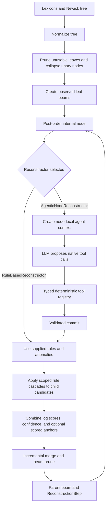

# Cognate Reconstruction Agent

`cognate_reconstruction` is a historical-linguistics workbench for
reconstructing parent forms from aligned descendant lexicons. It combines a
fully deterministic reconstruction engine with an optional LLM hypothesis
manager. The LLM proposes and tests hypotheses; it does not apply rules,
calculate scores, change the tree, or commit arbitrary data on its own.

The current implementation supports native n-ary trees, including unresolved
Glottolog-style polytomies. It does not invent binary ancestors merely to make a
tree convenient for an algorithm.

## What is implemented

The deterministic core provides:

- strict immutable Pydantic schemas for lexicons, trees, alignments, rules,
  beam candidates, anomalies, tool calls, and commits;
- Newick parsing, pruning of branches without usable data, unary-node collapse,
  and native n-ary post-order traversal;
- LingPy multiple sequence alignment across any two or more available nodes,
  with derived pairwise correspondence views and cognate-set-aware grouping;
- a literal token-level sound-law DSL and deterministic rule application;
- beam reconstruction with incremental merging and pruning to bound n-ary
  combinatorial growth;
- branch-scoped rules whose confidence contributes to candidate log scores;
- optional anchors with explicit `ignore`, `advisory`, and `scored` policies;
- auditable reconstruction steps containing input beams, output beams, rule
  reports, and anomaly reports.

The agent layer provides:

- provider-neutral message and native-tool-call schemas;
- a LiteLLM adapter for OpenAI, Anthropic, Gemini, and OpenAI-compatible or
  open-weight endpoints supported by LiteLLM;
- a bounded LLM/tool loop for one internal tree node;
- a Pydantic-backed tool registry;
- paginated concept/form search over active children and available tree evidence;
- read-only access to observed leaves and already reconstructed internal nodes;
- temporary morphological-boundary overlays; and
- a validated terminal commit that turns an LLM proposal into deterministic
  `ReconstructionRule` objects;
- versioned trajectory capture and JSONL export; and
- a high-level family inference result containing every internal-node vocabulary.

Install the optional provider adapter when using a live model:

```bash
pip install -e '.[agent]'
```

For an end-to-end LM Studio run, custom JSON format, verbose terminal trace,
and Lexibank preparation commands, see
[Running the reconstruction agent](docs/running_inference.md).

## Reconstruction flow



At every internal node, the traversal passes all direct children at once. A
three-way or ten-way Glottolog polytomy therefore remains a three-way or
ten-way reconstruction problem. Candidate combinations are merged and pruned
after each child is incorporated, so the engine does not materialize a full
Cartesian product.

## The deterministic reconstruction engine

`RuleBasedReconstructor` accepts a `Sequence[NodeBeamState]`, not a fixed
left/right pair. It combines evidence from active children by summing their
candidate log scores.

For a particular output candidate, the score is built from:

```text
sum(child candidate log scores)
+ sum(log(rule confidence) for rules that actually apply)
- log(number of distinct competing outputs in this derivation)
+ log(anchor_match_factor) for each unique matching anchor when policy=scored
```

Anchors are never required. `anchor_policy="advisory"` is the default for
ancestor reconstruction: matches appear in rule reports but do not affect beam
scores. `anchor_policy="scored"` enables the configurable factor, which defaults
to `100.0` for cognate-reflex-style use. `ignore` removes anchors from the node
session entirely. Scored anchor evidence is tracked per output form, so a match
for one possible output cannot boost a different competing output.

Rules are scoped with `source_child_ids`. A rule can target any number of the
active children, and a rule aimed at an inactive child is rejected. A legacy
unscoped `ParsedSoundRule` remains usable by the deterministic API and is
interpreted as applying to all active children with confidence `1.0`.

### Rule direction

Rules are operational **child-to-parent** transformations. For example:

```text
f > p / #_
```

means “when reconstructing the parent, transform child-initial `f` to `p`.”
The engine never guesses an inverse automatically, because ordinary historical
sound changes may be non-bijective.

### Sound-law DSL

The parser accepts literal token sequences in this form:

```text
target > replacement / environment
```

Examples:

```text
p > f
p > f / _#
k > tʃ / _ i
n > m / _ p
p > ∅ / _#
```

- `_` is the focus point in an environment.
- `#` is a word boundary and is valid only at an outer edge.
- Whitespace separates multiple tokens.
- `Ø` and `∅` delete the target.
- `+` and `-` are morphological-boundary tokens. They can be context, but not
  rule targets or inserted replacements.
- Morphological boundaries are not transparent: a context must name them when
  they matter.

## LLM function calling

`AgentOrchestrator` sends compact active-child summaries and optional anchors to
an LLM together with native tool schemas. Vocabulary evidence is retrieved on
demand, so a large family lexicon is not copied into every initial prompt. The
loop is bounded by default to 24 model turns and 64 tool calls.

| Tool | What the LLM chooses | What the code does deterministically |
| --- | --- | --- |
| `list_concepts` | Text query, evidence scope, nodes, page | Returns readable concept metadata, form counts, and stable IDs. |
| `search_forms` | Semantic text, concept/cognate IDs, segment pattern and position, evidence scope | Finds forms deterministically, including queries such as word-initial `/n/`. |
| `list_available_nodes` | Observed/reconstructed and topology-relation filters | Lists compact summaries of observed leaves and already completed internal nodes. |
| `get_alignments` | Any 2–N available nodes, concepts/forms, cognate policy, optional overlay/anchors | Runs one LingPy MSA and returns aligned members plus all derived pairwise correspondence views. |
| `segment_morphemes` | Forms to annotate, boundary positions, rationale | Verifies that only `+`/`-` boundaries changed, stores an immutable session-local overlay, and returns its ID. It never changes phonetic tokens. |
| `test_sound_law` | DSL, target child IDs, optional concepts and overlay | Parses the DSL, applies it mechanically to the selected forms, and returns the exact per-form diff: locations, input/output tokens, status, and anchor matches or mismatches. Syntax and validation failures are returned as structured tool errors. |
| `commit_reconstruction` | Ordered rules, child scopes, confidence, validation references, supporting forms, anomalies, summary | Checks the active node, child scopes, parser output, exact prior test call, supporting forms, overlay consistency, and anomaly subjects. Only then does it create deterministic `ReconstructionRule` objects. |

The LLM receives tool results in its conversation history and continues until it
makes a valid `commit_reconstruction` call. A text-only response does not finish
the task; the orchestrator asks it to use a tool or commit. Unknown tool names,
invalid JSON shapes, and `ValueError`s from the rule parser or tool adapters are
returned as tool results rather than becoming silent state changes.

## Scripted versus LLM-guided responsibilities

| Fully scripted and deterministic | LLM-guided, then validated |
| --- | --- |
| Tree parsing, normalisation, pruning, unary collapse, n-ary traversal, and evidence availability | Which concepts, nodes, and alignment scope to inspect |
| Leaf-beam construction, candidate merging, pruning, normalisation, and scoring | Which correspondence hypothesis to pursue |
| Rule DSL parsing, token matching, environment checks, replacement, and diffs | Proposed child-to-parent rule direction, scope, order, rationale, and confidence |
| Optional anchor comparison and policy-controlled scoring | Whether a temporary morphological segmentation is linguistically justified |
| Pydantic validation, tool schema generation, commit checks, and loop limits | Which tested forms support a rule and which items should be logged as anomalies |
| Replaying the committed cascade into the parent beam | The anomaly explanation and linguistic interpretation |

The LLM is therefore a hypothesis manager, not the reconstruction engine. It
cannot run arbitrary Python, alter a lexicon’s phonetic tokens through the
segmentation tool, bypass rule parsing, target children not present at the node,
or commit a rule that does not reference an exact previous test in the same
session.

## Using the agentic reconstructor

The core `TreeTraverser` remains unaware of LLM APIs. To use an LLM at every
internal node, supply `AgenticNodeReconstructor`, which implements the same
node-reconstructor protocol as the deterministic implementation.

```python
from cognate_reconstruction.agent import (
    AgenticNodeReconstructor,
    AgentOrchestrator,
    LiteLLMProvider,
    JsonlTrajectorySink,
    ReconstructionService,
)
from cognate_reconstruction.traversal import RuleBasedReconstructor

provider = LiteLLMProvider("openai/<model-name>")
orchestrator = AgentOrchestrator(
    provider,
    trajectory_sink=JsonlTrajectorySink("runs/trajectories.jsonl"),
)
deterministic = RuleBasedReconstructor(
    beam_width=5,
)
agentic = AgenticNodeReconstructor(
    orchestrator,
    deterministic=deterministic,
)

result = ReconstructionService(agentic).reconstruct_family(dataset)
```

`AgenticNodeReconstructor` converts each child beam into a node-local lexicon,
runs the LLM/tool session, applies the committed segmentation overlay if there
is one, and finally calls `RuleBasedReconstructor`. `result.snapshot` retains
the complete beams and audit reports; `result.internal_nodes` provides a best
lexicon plus the full beam for every reconstructed internal node. Anchors may be
passed to `reconstruct_family` but are not required.

## Trajectories and future training

Every completed node can produce a versioned `AgentTrajectory` containing the
instruction and tool-schema hashes, provider/model metadata, initial payload,
ordered messages, successful and failed tool results, validated commit, and
completion status. `JsonlTrajectorySink` can stream these records during a long
family run without retaining them all in memory.

`TrajectoryDatasetBuilder` reads trajectory JSONL and creates generic chat/tool
`TrainingExample` records. These are intentionally backend-neutral so later
Hugging Face/TRL or Unsloth adapters can consume the same frozen data contract.
No optimizer, online parameter update, or vendor-specific training API is
implemented yet.

## Current limits and deliberate boundaries

- The repository provides a basic verbose inference CLI, but not a credential
  manager, automatic Lexibank downloader, or resumable production scheduler.
- `test_sound_law` tests one rule at a time. Committed rules are executed as an
  ordered deterministic cascade during reconstruction, but there is not yet a
  separate tool dedicated to previewing an entire proposed cascade.
- Known cognate-set IDs are respected by default during alignment. When source
  data leave several same-concept synonyms unassigned, callers should select
  explicit `form_ids`; the aligner cannot infer cognacy from similarity alone.
- The commit validator confirms that each rule was tested with the exact DSL,
  child scope, overlay, and supporting form IDs. It cannot prove that the LLM’s
  linguistic rationale or anomaly classification is correct.
- Semantic lookup is deterministic over supplied concept glosses, aliases, IDs,
  and fields. Embedding-based semantic retrieval is not implemented.
- Anchors are optional supplementary evidence and anchor discovery is not automated.
- Trajectory export and training-example preparation are implemented, but an
  actual TRL/Unsloth training backend is deliberately deferred.
- Provider credentials, model choice, spend limits, retries, and production
  observability remain application-level configuration.

## Validation

Run the tests in the project environment:

```bash
conda run -n llm_reconstruction pytest -q tests
```

The test suite covers deterministic rule behavior, n-ary traversal, topology
normalization, child-scoped scoring, advisory/scored anchor policies, n-way
alignment, evidence availability, semantic and phonological form search,
malformed tool calls, commit validation, segmentation overlays, trajectory
round-tripping, complete internal-node inference, orchestration, and the LiteLLM
response adapter, plus the command-line inference harness and console events.
